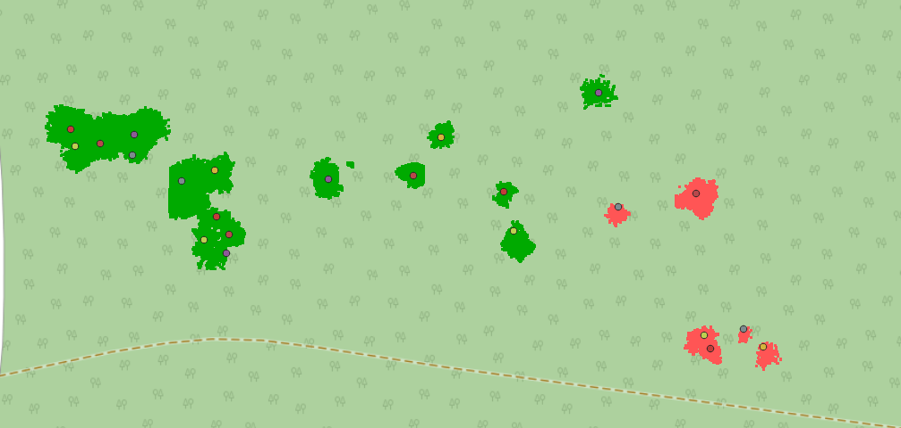

# pc-label_matcher

<center></center>

pc-label_matcher is  a small python script that associates labels to point cloud segments. It takes `las` point clouds and a `csv` with labels and geolocations and associate the closest closest label for each point cloud, and stores the label as `classification` of the las point cloud. This assumes that the `las` point cloud contains point of [format 0](https://www.asprs.org/wp-content/uploads/2019/03/LAS_1_4_r14.pdf) (to contain the "classification" field).

## Usage
A conda environment is provided, so assuming you have [conda](https://anaconda.org/anaconda/conda) installed, open a terminal at the root of the repository and run:
```bash
conda env create -f environment.yml
```

This will take a while, the once finished, activate the environment:

```bash
conda activate pc-label_matcher
```

Once the environment activated, put your data in the `./data` directory. We provide example files. If you want all the `las` files to be in the `./data/point_clouds` folder directly (not individually in subfolder), no problem it is supported.

To run the code if the `las` files are as in our example, run:
```bash
python ./src/main.py --dir_depth  2
```

If you prefer to have them all in the `point_clouds` folder directly, use:
```bash
python ./src/main.py --dir_depth  1
```